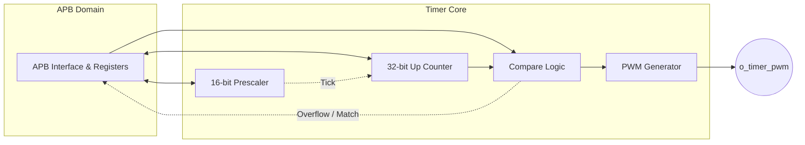

# 🚀 APB Timer IP Core

[](https://opensource.org/licenses/MIT)
[](#)
[](#)

A highly configurable, **Tapeout-Ready**, and **UVM-Verified** Hardware Timer and PWM generation IP Core. Designed with a standard 32-bit APB interface for MCU and RISC-V SoC environments.

---

## 🌟 Key Features

*   **Standard Interface:** 32-bit APB (AMBA 3) interface.
*   **Operating Modes:** Up-counting Continuous (Periodic) and One-shot modes.
*   **Prescaler:** Fully programmable 16-bit prescaler for exact timekeeping.
*   **PWM Generation:** Hardware PWM output with 32-bit precise frequency and duty cycle control.
*   **Hardware Protections:** Write-1-to-Clear interrupt management and safe reload value checks.

---

## 🏗️ Architecture Overview



---

## 🗺️ Register Map

| Offset | Register Name | Access | Description |
| :--- | :--- | :--- | :--- |
| `0x00` | **`CTRL`** | R/W | `[0]` Enable, `[1]` One-shot, `[2]` PWM Enable, `[31:16]` Prescaler. |
| `0x04` | **`STATUS`** | R/O | `[0]` Overflow, `[1]` Compare Match. |
| `0x08` | **`VALUE`** | R/W | Current 32-bit counter value. |
| `0x0C` | **`RELOAD`** | R/W | Maximum counter limit (Period). |
| `0x10` | **`COMPARE`** | R/W | Match limit (PWM Duty Cycle). |
| `0x14` | **`IRQ_EN`** | R/W | Interrupt enable mask. |
| `0x18` | **`IRQ_STAT`** | R/W1C | Interrupt status flags. |

> [!TIP]
> **PWM Configuration:** To generate PWM, write your target Period to `RELOAD`, your high-time to `COMPARE`, and set `CTRL[2] = 1`. 

---

## 💻 Integration Guide

```verilog
apb_timer_wrapper u_timer (
    .i_timer_pclk     (sys_clk),
    .i_timer_presetn  (sys_rst_n),
    .i_timer_paddr    (apb_paddr),
    .i_timer_psel     (apb_psel),
    .i_timer_penable  (apb_penable),
    .i_timer_pwrite   (apb_pwrite),
    .i_timer_pwdata   (apb_pwdata),
    .i_timer_pstrb    (apb_pstrb),
    .o_timer_prdata   (apb_prdata),
    .o_timer_pready   (apb_pready),
    .o_timer_pslverr  (apb_pslverr),
    .o_timer_irq      (timer_irq),
    .o_timer_pwm      (timer_pwm)
);
```
